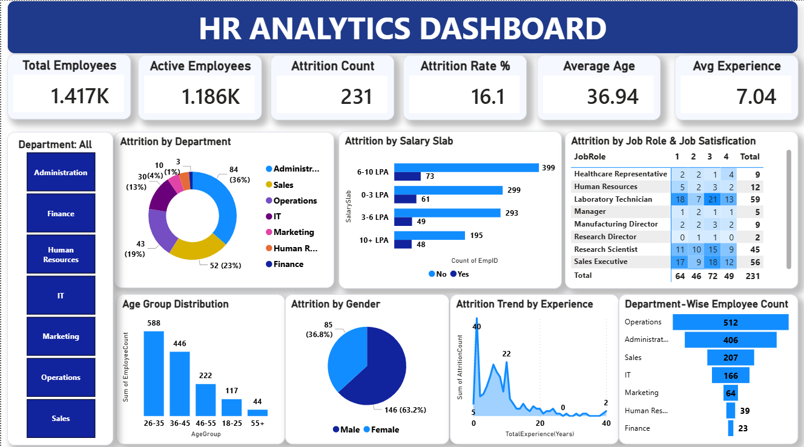
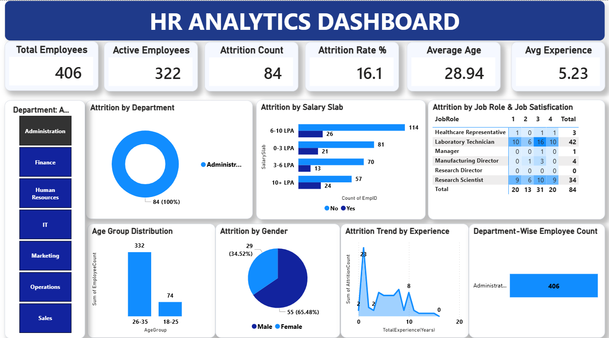
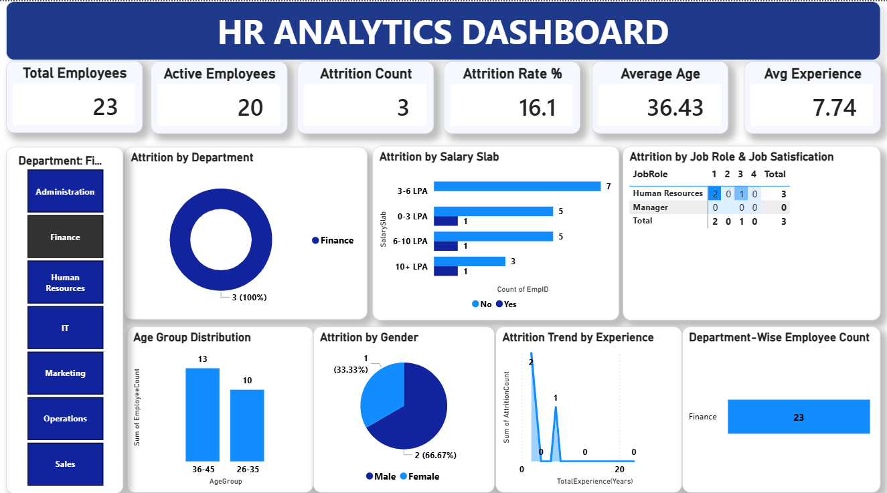
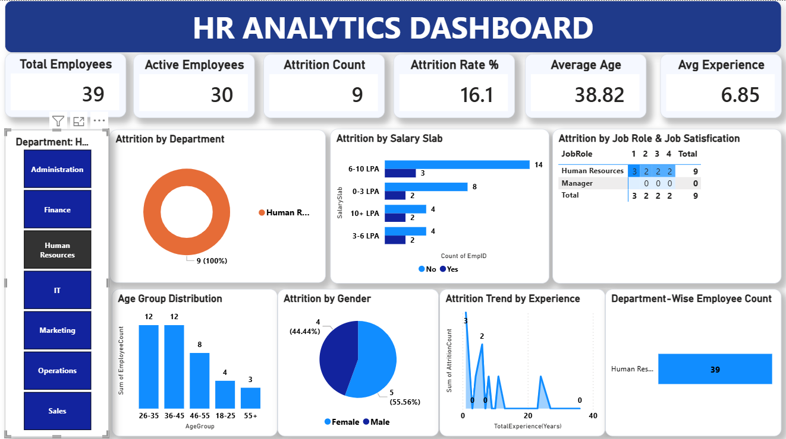
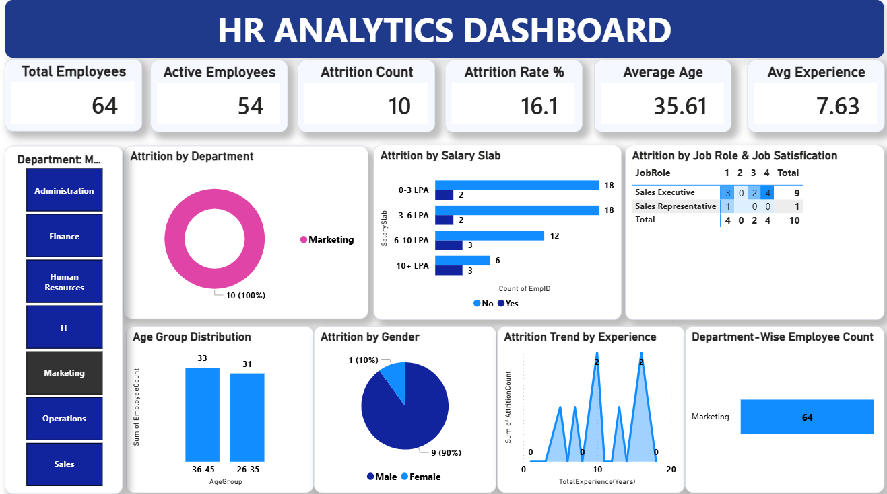
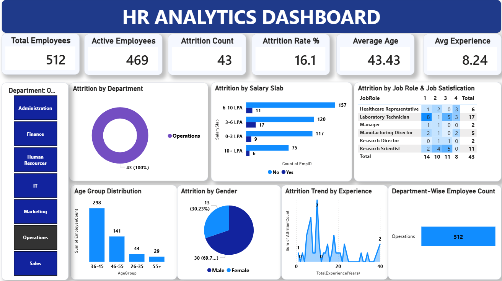
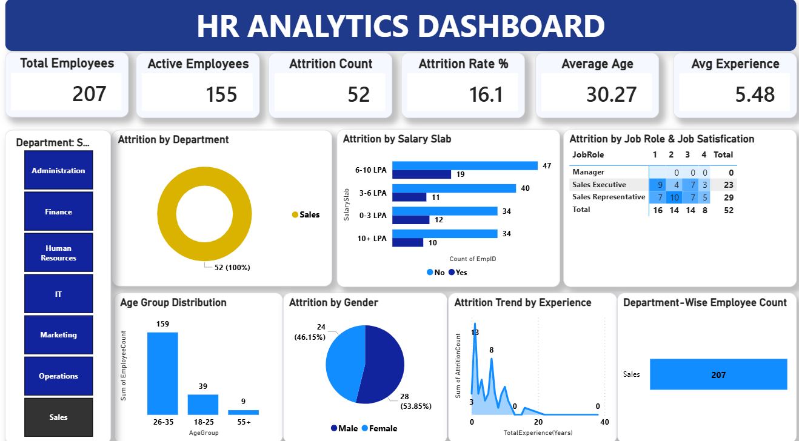

# HR Analytics Dashboard

## 📌 Project Overview
This project is an interactive HR Analytics Dashboard developed using Power BI to analyse employee attrition, workforce trends, job satisfaction, and key HR metrics.

## 🛠️ Tools Used
- Power BI
- Microsoft Excel

## 📊 Dashboard Preview

### Overall Dashboard

### Administration

### Finance Department

### Human Resources

### Marketing

### Operations

### Sales

---

## 🎯 Objectives
- Analyse employee attrition.
- Monitor workforce trends.
- Compare department-wise performance.
- Support HR decision-making.
---

## 📂 Dataset
- Source: HR Employee Dataset
- Format: CSV
- Records: 1,470+
- Features: 35+
---

## 📊 Key Performance Indicators
- Total Employees
- Active Employees
- Attrition Count
- Attrition Rate
- Average Age
- Average Experience

---

## 💡 Key Insights
- Overall Attrition Rate: **16.1%**
- Operations department has the highest employee count.
- Sales department recorded high attrition.
- Most employees belong to the 26–35 age group.
- Employees in lower salary slabs show higher attrition.

---

## 📁 Repository Structure

HR_Analytics_Dashboard/
├── Images/
├── HR_Analytics_Dashboard.pbix
├── HR_Analytics-4.csv
└── README.md

---

## 🚀 Future Improvements
- Predict employee attrition using Machine Learning.
- Connect SQL Server for live data.
- Publish dashboard to Power BI Service.
- Add real-time data refresh.

---

## 👨‍💻 Author

**Vemireddy Sivaprasad Reddy**

📧 Email: vemireddysivaprasad567@gmail.com

🔗 GitHub: https://github.com/vemireddysivaprasad567-source

---

⭐ If you found this project useful, consider giving it a Star.
